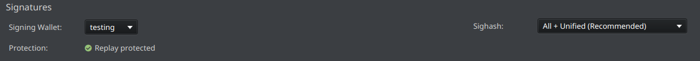
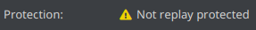
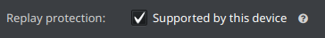
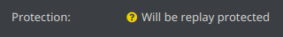

# Shrike

Shrike is an unofficial fork of [Sparrow Bitcoin Wallet](https://github.com/sparrowwallet/sparrow) that follows the BLAKE2b proof-of-work hardfork of Bitcoin and signs with the unified opt-in signature hash. It is not affiliated with the Sparrow project. Upstream Sparrow has not added support for it, so use it instead if that is what you want.

> **Not audited. Use at your own risk, and no warranty of any kind, see the [Apache 2.0 license](LICENSE).** Everything below the divider is upstream's documentation and describes Sparrow rather than Shrike.

## What differs from Sparrow

- **BLAKE2b proof of work.** Validates the 164 byte v2 block header and takes the BLAKE2b hash as the block id past activation. Implemented in the [drongo](https://github.com/privkeyio/drongo) submodule.
- **Unified opt-in signature hash.** Signs with hash type `0x21` past activation, which is invalid under the pre-fork rules and is what makes it unreplayable. Where it cannot opt in, the wallet signs the legacy way and says so on the send screen.
- **Per-keystore opt-in.** Nothing a device or a watch only keystore reports says what will sign for it, so each is marked by hand under Replay protection. A keystore holding its own key needs no mark. One marked signer is enough, and unmarked signers still sign: each is handed the hash type it can produce.
- **Only services that kept up are offered.** Fee rates, explorer links and broadcast use mempool.guide; the preconfigured public Electrum servers are gone, because they stopped at the activation height. Connect a Knots node, or your own Electrum server indexing one.
- **Separate application identity.** Installs alongside an existing Sparrow without sharing state: `~/.shrike`, its own packages, desktop entries, MIME types and macOS bundle identifier.

## Activation

| Network | Height |
| --- | --- |
| mainnet | 961,640 |
| testnet4 | 150,308 |

The compiled-in height is cross checked against the connected node where it reports one, and a disagreement declines to opt in rather than following either. Only Knots reports it, through `getdeploymentinfo`; through anything else the wallet still opts in and says the height went unchecked.

## Replay protection

A signature that does not opt in is valid under both rule sets. Where the coins it spends also exist on the SHA256d chain, that makes the transaction replayable there. **Check the send screen before building anything.** The opt-in is selected by default:



Where it reads this instead, hovering the status names what is refusing and what to do about it:



Where a signer is the reason, tick it in the keystore tab of the wallet settings. Nothing a device reports says which firmware it runs, so this is what its owner tells the wallet, and it is off until they say so:



Opening the transaction afterwards answers in two steps, because it looks at the signatures that are actually on it. Before anyone has signed there is nothing to look at yet, so it tells you what the transaction will be:



After signing, the wallet checks each signature against its own keys and tells you what the transaction is. A question mark means not checked yet, not unprotected. Until the wallet can check for itself it will not say either way, because a transaction file can claim anything about itself: open one without its wallet, or with signatures this wallet cannot read, and it stays unchecked rather than guessed at.

**In a multisig** one marked signer is enough. Mark two of a 2-of-3 and every transaction opts in; mark one and the opt-in depends on that signer taking part, which the wallet says rather than promising in advance.

**The exception is Anyone Can Pay**, which commits only to its own input and the outputs, so that input can be lifted out and spent on the SHA256d chain, even though the transaction cannot. The send screen names such signatures. Shrike never selects it by itself.

Coins held across activation are only separated once spent with an opted-in signature, and a spend covers only the inputs it consumes, so sweep every pre-fork UTXO to yourself before transacting with anyone on the SHA256d chain.

## Building

Clone this repository rather than upstream's, and `--recursive` matters: the BLAKE2b work lives in the drongo submodule.

```bash
git clone --recursive https://github.com/privkeyio/shrike.git
```

Java requirements and the build itself are unchanged, see [Building](#building-1) below.

## Releases

Published under [Releases](https://github.com/privkeyio/shrike/releases) with a signed `SHA256SUMS` covering every file:

```bash
gpg --import privkeyio-signing-key.asc
gpg --verify SHA256SUMS.asc SHA256SUMS
sha256sum --ignore-missing -c SHA256SUMS
```

Signed by Kyle Santiago <kyle@privkey.io>, key `A47D99B6DB0D715D40C59A2023AE8A8EA7E24E38`.

The macOS builds are not notarized and the Windows installer is not Authenticode signed, so both are reported as untrusted on first launch. Verify `SHA256SUMS` first, because clearing quarantine removes the check that would otherwise stop a tampered download:

```bash
xattr -dr com.apple.quarantine /Applications/Shrike.app
```

Reproducible: see [reproducible.md](docs/reproducible.md). The proof of work and the signature hash are verified end to end against a live forked regtest node, see [blake2b-regtest.md](docs/blake2b-regtest.md) and [unified-sighash-regtest.md](docs/unified-sighash-regtest.md).

## Reporting issues

Use the [Issues](https://github.com/privkeyio/shrike/issues) tab for problems specific to this fork. Anything else belongs [upstream](https://github.com/sparrowwallet/sparrow/issues).

## Credit

The v2 block header, the BLAKE2b proof of work, the separate application identity and the packaging were written by [AcesHigh70](https://github.com/AcesHigh70), and are no longer maintained there. This fork continues that work and adds the unified opt-in signature hash.

---
# Sparrow Bitcoin Wallet

Sparrow is a modern desktop Bitcoin wallet application supporting most hardware wallets and built on common standards such as PSBT, with an emphasis on transparency and usability.

More information (and release binaries) can be found at https://sparrowwallet.com. Release binaries are also available directly from [GitHub](https://github.com/sparrowwallet/sparrow/releases).


## Building

To clone this project, use

`git clone --recursive git@github.com:sparrowwallet/sparrow.git`

or for those without SSH credentials:

`git clone --recursive https://github.com/sparrowwallet/sparrow.git`

In order to build, Sparrow requires Java 25 or higher to be installed. 
The release binaries are built with [Eclipse Temurin 25.0.2+10](https://github.com/adoptium/temurin25-binaries/releases/tag/jdk-25.0.2%2B10).
If you are using [SDKMAN](https://sdkman.io/), you can use `sdk env install` to ensure you have the correct version.

Other packages may also be necessary to build depending on the platform. On Debian/Ubuntu systems:

`sudo apt install -y rpm fakeroot binutils`

The Sparrow binaries can be built from source using

`./gradlew jpackage`

On Linux distributions without `deb` or `rpm` packaging tools installed (such as Arch), building the installers can be skipped with

`./gradlew jpackage -PskipInstallers=true`

Note that to build the Windows installer, you will need to install [WiX](https://github.com/wixtoolset/wix3/releases).

When updating to the latest HEAD

`git pull --recurse-submodules`

The release binaries are reproducible from v1.5.0 onwards (pre codesigning and installer packaging). More detailed [instructions on reproducing the binaries](docs/reproducible.md) are provided.

> Video documentation of your build process uploaded to [bitcoinbinary.org](https://bitcoinbinary.org/) is appreciated. Alternatively check the site if you wish to see if someone else already verified the provided binaries. 

## Running

If you prefer to run Sparrow directly from source, it can be launched from within the project directory with

`./sparrow`

Java 25 or higher must be installed. 

## Configuration

Sparrow has a number of command line options, for example to change its home folder or use testnet:

```
./sparrow -h

Usage: sparrow [options]
  Options:
    --dir, -d
      Path to Sparrow home folder
    --help, -h
      Show usage
    --level, -l
      Set log level
      Possible Values: [ERROR, WARN, INFO, DEBUG, TRACE]      
    --network, -n
      Network to use
      Possible Values: [mainnet, testnet, regtest, signet, testnet4]
```

Note that testnet currently refers to testnet3.

As a fallback, the network (mainnet, testnet, testnet4, regtest or signet) can also be set using an environment variable `SPARROW_NETWORK`. For example:

`export SPARROW_NETWORK=testnet`

A final fallback which can be useful when running the Sparrow binary is to create a file called ``network-testnet`` in the Sparrow home folder (see below) to configure the testnet network.

Note that if you are connecting to an Electrum server when using testnet, that server will need to be running on testnet configuration as well.

When not explicitly configured using the command line argument above, Sparrow stores its mainnet config file, log file and wallets in a home folder location appropriate to the operating system:

| Platform | Location |
|----------| -------- |
| macOS    | ~/.sparrow |
| Linux    | ~/.sparrow |
| Windows  | %APPDATA%/Sparrow |

Testnet3, testnet4, regtest and signet configurations (along with their wallets) are stored in subfolders to allow easy switching between networks.

On macOS and Linux, Sparrow also supports the [XDG Base Directory Specification](https://specifications.freedesktop.org/basedir-spec/latest/). 
This is opt in: for each category below, if the corresponding directory already exists, Sparrow uses it, otherwise it continues to use the home folder above. Categories are resolved independently, so files can be moved across one at a time.

| Category | Location | Contents                              |
|----------| -------- |---------------------------------------|
| Config   | `$XDG_CONFIG_HOME/sparrow` (default `~/.config/sparrow`) | `config`, `network-*` markers         |
| Data     | `$XDG_DATA_HOME/sparrow` (default `~/.local/share/sparrow`) | `wallets`, `certs`, `lark`            |
| State    | `$XDG_STATE_HOME/sparrow` (default `~/.local/state/sparrow`) | `sparrow.log`, `tor/work`, lock files |
| Cache    | `$XDG_CACHE_HOME/sparrow` (default `~/.cache/sparrow`) | `tor/cache`                           |

Specifying a home folder with the `-d` argument disables XDG resolution entirely, and stores all files in the given folder.

## Reporting Issues

Please use the [Issues](https://github.com/privkeyio/shrike/issues) tab above to report an issue with this fork. Issues that are not specific to the BLAKE2b fork should be reported [upstream](https://github.com/sparrowwallet/sparrow/issues) instead. If possible, look in the sparrow.log file in the configuration directory for information helpful in debugging. 

## License

Sparrow is licensed under the Apache 2 software licence.

## GPG Key

Sparrow's own release binaries, on [sparrowwallet.com](https://sparrowwallet.com/download/), are signed using [craigraw's GPG key](https://keybase.io/craigraw). The releases in this repository are not: they are signed with the key under [Releases](#releases) above.  
Fingerprint: D4D0D3202FC06849A257B38DE94618334C674B40  
64-bit: E946 1833 4C67 4B40

## Credit


Sparrow Wallet uses the [Yourkit Java Profiler](https://www.yourkit.com/java/profiler/) to profile and improve performance. 
YourKit supports open source projects with useful tools for monitoring and profiling Java and .NET applications.
